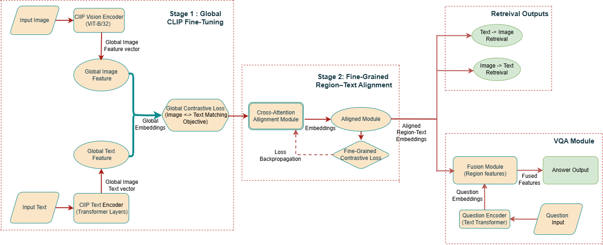

# Fine-Grained Multimodal Alignment with Cross-Attention Using CLIP for Enhanced Retrieval

> Lightweight Two-Stage Vision–Language Alignment Framework for Low-Resource Settings  
> Flickr8k | CLIP | Cross-Attention | Faster R-CNN | Retrieval | VQA  

---

## 📋 Table of Contents

- [Overview](#-overview)
- [Motivation](#-motivation)
- [Architecture](#-architecture)
- [Methodology](#-methodology)
  - [Stage 1 — Global CLIP Fine-Tuning](#stage-1--global-clip-fine-tuning)
  - [Stage 2 — Fine-Grained Cross-Attention](#stage-2--fine-grained-cross-attention)
  - [VQA Module](#-vqa-module)
- [Dataset](#-dataset)
- [Training Configuration](#-training-configuration)
- [Experimental Results](#-experimental-results)
- [Ablation Study](#-ablation-study)
- [Computational Efficiency](#-computational-efficiency)
- [Repository Structure](#-repository-structure)
- [How to Run](#-how-to-run)
- [Citation](#-citation)
- [Authors](#-authors)

---

# 🔎 Overview

This repository implements a two-stage multimodal alignment framework designed for low-resource vision–language learning.

Large-scale models like CLIP perform strongly on massive datasets but struggle under small datasets such as **Flickr8k (8,092 images, 40,460 captions)**.

This work proposes:

- **Stage 1:** Gentle global fine-tuning of CLIP  
- **Stage 2:** Lightweight region–token cross-attention alignment  
- Retrieval-based VQA head  

The framework improves Recall@1 significantly while remaining computationally efficient and stable.

---

# 🎯 Motivation

Global embeddings alone fail to capture:

- Word–object grounding  
- Region-level semantics  
- Fine-grained relationships such as:
  - “dog chasing frisbee”
  - “frisbee near dog”

Heavy multimodal fusion architectures require large datasets and become unstable in low-resource settings.

Our solution decouples:

> Global semantic alignment  
> Fine-grained region–token grounding  

---

# 🏗 Architecture



---

### 🔄 Pipeline Overview

```
Input Image → CLIP Vision Encoder → Global Image Embedding
Input Text  → CLIP Text Encoder   → Global Text Embedding

Stage 1:
Contrastive Loss on Global Embeddings

Stage 2:
Faster R-CNN → Region Features
Token Embeddings from CLIP
↓
Cross-Attention Module
↓
Fine-Grained Similarity
↓
Combined Score = Global + Fine
```

---

# 🧠 Methodology

## Stage 1 — Global CLIP Fine-Tuning

Global similarity:

```
s_global(I, T) = cos(g_I, g_T) / τ
```

Where:
- g_I = Image embedding
- g_T = Text embedding
- τ = 0.07

We optimize NT-Xent contrastive loss.

---

## Stage 2 — Fine-Grained Cross-Attention

Let:

- r_k ∈ R^d = region feature (Faster R-CNN)
- t_m ∈ R^d = token embedding

Cross-attention weights:

```
α_mk = exp(t_mᵀ W_qᵀ W_k r_k)
       / Σ_k' exp(t_mᵀ W_qᵀ W_k r_k')
```

Region aggregation:

```
v_m = Σ_k α_mk W_v r_k
```

Fine-grained similarity:

```
s_fine(I, T) = (1/M) Σ_m t_mᵀ W_o v_m
```

Final similarity score:

```
s(I, T) = s_global(I, T) + λ s_fine(I, T)
```

Where:

- λ = 1.0  
- CLIP backbones are frozen during Stage 2  
- Only cross-attention layers are updated  

---

# 🧩 VQA Module

Instead of training a supervised classifier:

1. Encode image using CLIP  
2. Encode question using CLIP  
3. Match question embedding with caption embeddings  
4. Return highest similarity caption  

This retrieval-based VQA design keeps the system lightweight and stable.

---

# 📊 Dataset

**Flickr8k**

- 8,092 images  
- 40,460 captions (5 per image)  
- Split:
  - 6,000 training  
  - 1,000 validation  
  - 1,000 testing  

Represents a low-resource multimodal setting.

---

# ⚙️ Training Configuration

- Optimizer: AdamW  
- Learning Rate: 1e-5  
- Weight Decay: 1e-4  
- Batch Size: 64  
- Temperature (τ): 0.07  
- Stage 1 Epochs: 12  
- Stage 2 Epochs: 12  
- Mixed Precision (AMP)  
- Random Seed: 42  

Stage 1:
- End-to-end CLIP fine-tuning  

Stage 2:
- CLIP frozen  
- Cross-attention layers trained  

---

# 📈 Experimental Results

## Text-to-Image Retrieval

| Model | R@1 | R@5 | R@10 |
|-------|------|------|------|
| CLIP Zero-Shot | 50.50% | 70.23% | 83.45% |
| CLIP Fine-Tuned | 71.41% | 89.25% | 91.87% |
| **Proposed (Global + Fine-Grained)** | **75.59%** | **92.33%** | **93.73%** |

---

## Image-to-Text Retrieval

| Model | R@1 | R@5 | R@10 |
|-------|------|------|------|
| CLIP Zero-Shot | 56.12% | 81.61% | 89.78% |
| CLIP Fine-Tuned | 83.06% | 84.27% | 88.48% |
| **Proposed (Global + Fine-Grained)** | **87.21%** | **89.88%** | **92.88%** |

---

# 🧪 Ablation Study

| Model Variant | Text→Image R@1 |
|---------------|----------------|
| Global CLIP Fine-Tuning | 71.41% |
| + Cross-Attention (λ = 1.0) | **75.59%** |

Fine-grained alignment improves Recall@1 by ~4%.

---

# ⚡ Computational Efficiency

- Cross-attention module is lightweight  
- CLIP encoders frozen in Stage 2  
- Faster R-CNN features precomputed  
- Minimal additional GPU overhead  
- Stable training under low-resource conditions  

---

# 📂 Repository Structure

```
Fine-Grained-Multimodal-Alignment-CLIP/
│
├── notebooks/
│   └── fine_grained_clip_alignment.ipynb
│
├── images/
│   └── architecture.png
│
├── paper/
│   └── paper.pdf
│
├── requirements.txt
└── README.md
```

---

# 🚀 How to Run

1. Open notebook in Google Colab  
2. Mount Google Drive  
3. Set dataset path:
```
DRIVE_ROOT = '/content/drive/MyDrive/.../flickr8k'
```
4. Run all cells sequentially  

---

# 📜 Citation

If you use this work, please cite:

```
@article{FineGrainedCLIP2026,
  title={Fine-Grained Multimodal Alignment with Cross-Attention Using CLIP for Enhanced Retrieval},
  author={Khushi R and Swetha Kadabgaon and Saniyanaz Momin and Nidhi Kugunavar},
  institution={KLE Technological University},
  year={2026}
}
```

---

# 👩‍💻 Authors (Equal Contribution)

This project was developed collaboratively with equal contribution from all authors.

- **Khushi R** — https://github.com/khushir2345  
- **Saniyanaz Momin** — https://github.com/saniyanazmomin23-tech  
- **Swetha Kadabgaon** — https://github.com/swethakadabgaon2709  
- **Nidhi Kugunavar** — https://github.com/nidhi-ii24
  
---
